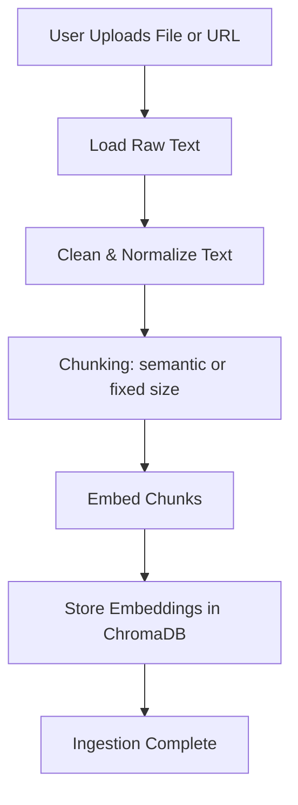

# Document & Webpage Ingestion Flow

```mermaid
flowchart TD
    A[User Uploads File or URL] --> B[Load Raw Text]
    B --> C[Clean & Normalize Text]
    C --> D[Chunking: semantic or fixed size]
    D --> E[Embed Chunks]
    E --> F[Store Embeddings in ChromaDB]
    F --> G[Ingestion Complete]
```
