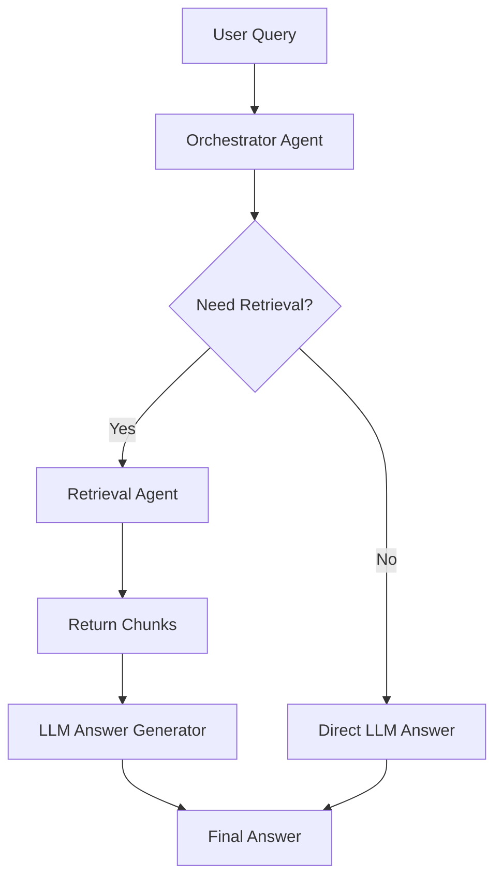

# Multi-Agent Orchestration Flow

```mermaid
flowchart TD
    A[User Query] --> B[Orchestrator Agent]
    B --> C{Need Retrieval?}
    C -->|Yes| D[Retrieval Agent]
    D --> E[Return Chunks]
    E --> F[LLM Answer Generator]
    F --> G[Final Answer]
    C -->|No| H[Direct LLM Answer]
    H --> G
```
