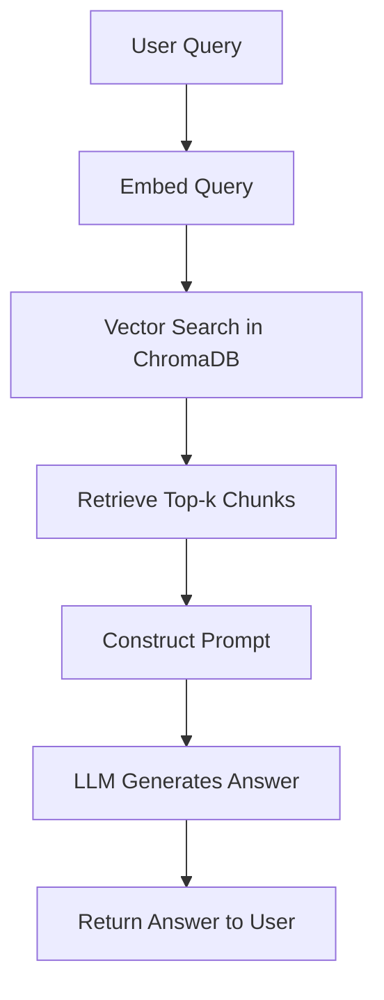

# RAG Pipeline Flow

```mermaid
flowchart TD
    A[User Query] --> B[Embed Query]
    B --> C[Vector Search in ChromaDB]
    C --> D[Retrieve Top-k Chunks]
    D --> E[Construct Prompt]
    E --> F[LLM Generates Answer]
    F --> G[Return Answer to User]
```
