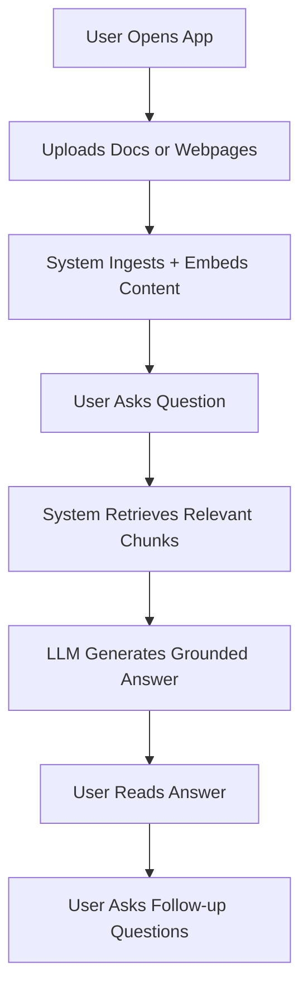

# RAG Playground — User Journey

```mermaid
flowchart TD
    A[User Opens App] --> B[Uploads Docs or Webpages]
    B --> C[System Ingests + Embeds Content]
    C --> D[User Asks Question]
    D --> E[System Retrieves Relevant Chunks]
    E --> F[LLM Generates Grounded Answer]
    F --> G[User Reads Answer]
    G --> H[User Asks Follow-up Questions]
```
